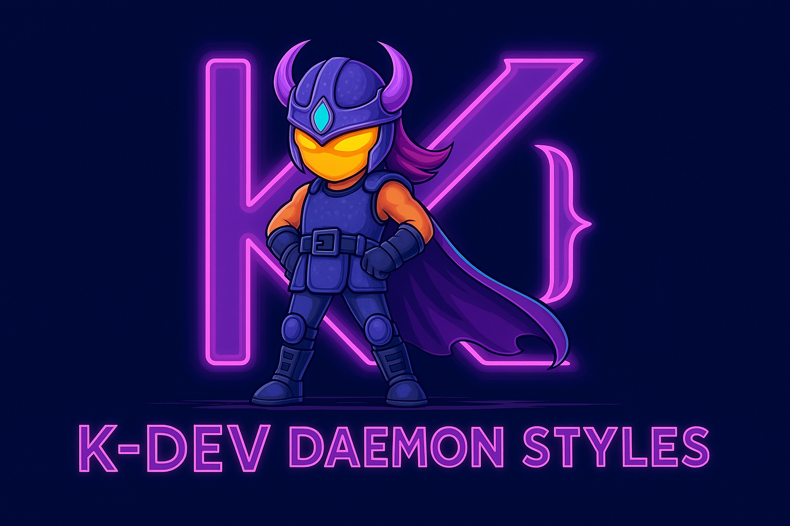

# kstyled

[](https://github.com/hyodotdev/kstyled/actions/workflows/ci.yml)
[](https://www.npmjs.com/package/kstyled)
[](https://www.npmjs.com/package/kstyled)
[](https://opensource.org/licenses/MIT)

⚡️ **Compile-time CSS-in-JS for React Native** • styled-components API with zero runtime overhead

<p align="center">
  
</p>

## Quick Start

```bash
pnpm add kstyled
pnpm add -D babel-plugin-kstyled
```

```javascript
// babel.config.js
module.exports = {
  presets: ['babel-preset-expo'],
  plugins: ['babel-plugin-kstyled'],
};
```

```tsx
import { styled } from 'kstyled';
import { View, Text } from 'react-native';

const Container = styled(View)`
  flex: 1;
  background-color: #f0f0f0;
`;

const Title = styled(Text)<{ $primary?: boolean }>`
  font-size: 24px;
  color: ${p => p.$primary ? '#007AFF' : '#000'};
`;

export default function App() {
  return (
    <Container>
      <Title $primary>Hello kstyled!</Title>
    </Container>
  );
}
```

## Features

- ⚡️ **Zero runtime** - Styles compiled to `StyleSheet.create` at build time
- 🎨 **Familiar API** - styled-components syntax you already know
- 🎭 **Theme support** - Built-in ThemeProvider with TypeScript
- 💪 **Full TypeScript** - Complete type inference
- 📦 **Tiny bundle** - Minimal runtime code

## Documentation

See the [full documentation](https://hyodotdev.github.io/kstyled) for:
- Getting Started guides
- Styling patterns (static, dynamic, theming)
- API reference
- Performance benchmarks

## License

MIT © [hyodotdev](https://hyo.dev)
